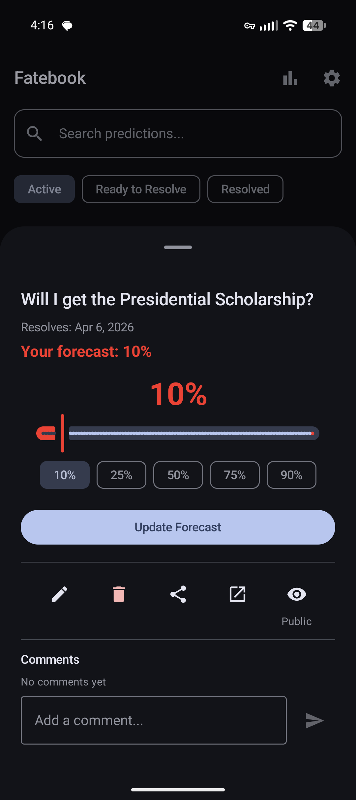
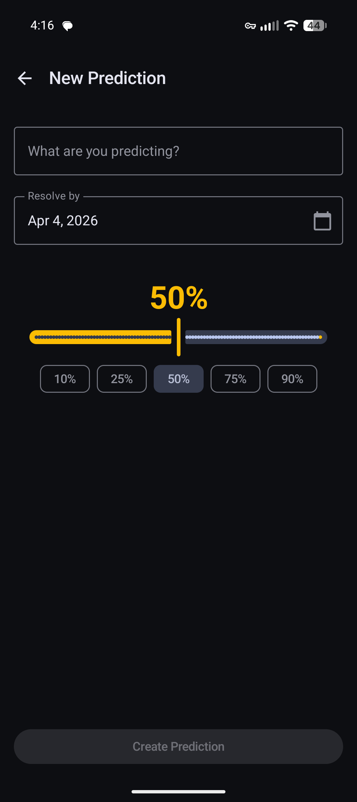
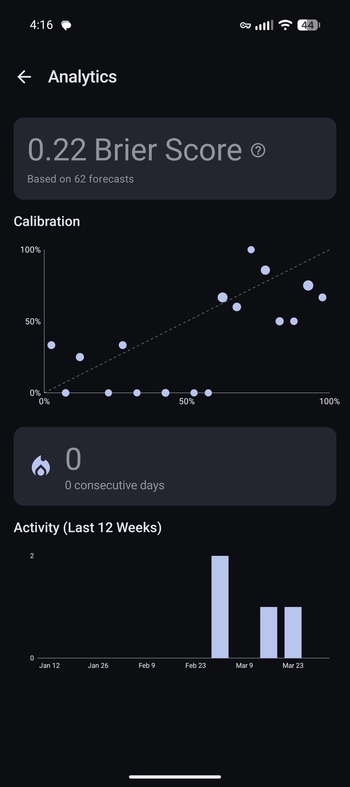
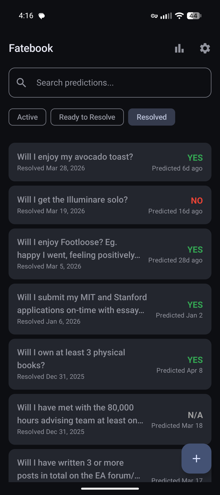
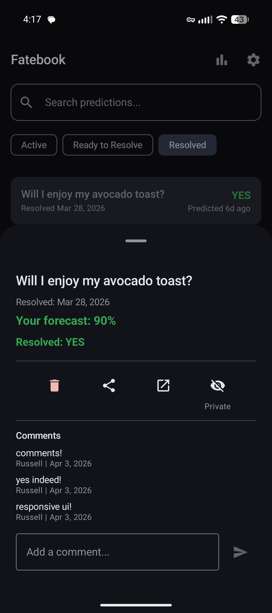
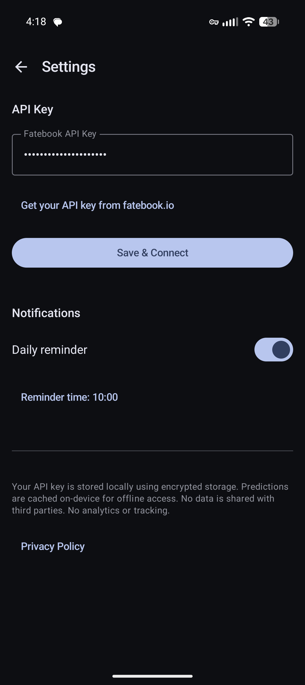

# Fatebook for Android

An unofficial Android client for [Fatebook](https://fatebook.io), the prediction-tracking platform. Built to make daily prediction logging frictionless on mobile.

<table>
  <tr>
    <td></td>
    <td></td>
    <td></td>
    <td></td>
  </tr>
</table>

## Features

- **Question feed** — filterable list (Active / Ready to Resolve / Resolved) with pull-to-refresh, search, shimmer loading, and infinite-scroll pagination
- **Quick create** — title, resolve-by date picker, probability slider with quick-set chips (10/25/50/75/90%)
- **Question detail sheet** — tap any card to view details, forecast, resolution, and comments. Includes edit, delete, share, open-in-browser, and public/private visibility toggle
- **Resolve flow** — YES / NO / Ambiguous buttons for questions past their resolve date
- **Update forecasts** — slider in the detail sheet to revise your probability on active questions
- **Comments** — view and add comments on any question, synced from the API and persisted in Room
- **Analytics** — Brier score, calibration chart, prediction streak, and weekly activity chart
- **Notifications** — two independent channels: a daily reminder (always fires) and a ready-to-resolve alert (fires when overdue questions exist)
- **Offline-first** — Room cache shows questions immediately; background API sync
- **Material You** — dynamic color theming on Android 12+, dark mode support

<table>
  <tr>
    <td></td>
    <td></td>
    <td></td>
  </tr>
</table>

## Install

1. Download the latest APK from [GitHub Releases](https://github.com/JapanColorado/fatebook-android/releases/latest)
2. Open the APK on your Android device to install
3. Get your API key at [fatebook.io/api-setup](https://fatebook.io/api-setup)
4. Open the app → Settings → paste the key → Save & Connect

## Development

### Prerequisites

- [pixi](https://pixi.sh) package manager
- Android SDK (installed at `/usr/lib/android-sdk`, or update `local.properties`)
- Android phone with USB debugging enabled

### Build & Install

```bash
pixi install           # Install JDK + Gradle via pixi
pixi run build         # Build debug APK
pixi run deploy        # Build + install to connected device
```

> Do not run `./gradlew` directly — the system only has a JRE. pixi provides the full JDK.

### Testing

```bash
pixi run test                   # All JVM tests
pixi run test-unit              # Unit tests only
pixi run test-screenshot-record # Regenerate Paparazzi golden images
pixi run test-screenshot-verify # Verify against golden images
pixi run lint                   # Lint checks
```

Unit tests use JUnit + MockK + Turbine + Truth. Screenshot tests use [Paparazzi](https://github.com/cashapp/paparazzi) to render Compose UI on JVM — no emulator needed.

### Architecture

MVVM + Repository pattern, offline-first.

```
Fatebook REST API → FatebookApi (Retrofit) → QuestionRepository → Room DB
                                                                 ↕
                                                              ViewModels → Compose UI
```

### Tech Stack

Kotlin, Jetpack Compose, Hilt, Retrofit + Moshi, Room, WorkManager, DataStore, EncryptedSharedPreferences

## License

Personal project. Not affiliated with Fatebook/Sage.
